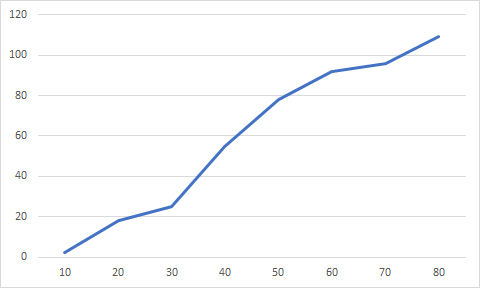

## Комп'ютерні системи імітаційного моделювання
## СПм-22-3, **Близнюк Олександр Валерiйович**
### Лабораторна робота №**1**. Опис імітаційних моделей та проведення обчислювальних експериментів

 

### Варіант 3, модель у середовищі NetLogo:
[Virus](https://www.netlogoweb.org/launch#https://www.netlogoweb.org/assets/modelslib/Sample%20Models/Biology/Virus.nlogo)

 

### Вербальний опис моделі:
Ця модель імітує передачу та збереження вірусу в людській популяції. Біологи-екологи запропонували ряд факторів, які можуть впливати на виживання вірусу, що передається безпосередньо в популяції.

### Керуючі параметри:
- **number-people** визначає щільність населення, яке впливає на те, як часто інфіковані, імунні та сприйнятливі особи контактують один з одним.
- **infectiousness** визначає як легко поширюється вірус. 
- **chance-recover** визначає вiрогiднiсть одужування вiд вiрусу, та отримання iммунiтету.
- **duration** визначає cкільки часу людина буде iнфiкована, перш ніж одужає або помре.

### Внутрішні параметри:
- **%infected**. Процентна кiлькiсть iнфiкованих людей.
- **%immune**. Процентна кiлькiсть людей отримавших iммунiтет до вiрусу.
- **years**. Тривалicть cимуляцii у роках.
 
### Показники роботи системи:
- кiлькiсть iнфiкованих людей на поточному такті симуляції.
- кiлькiсть людей отримавших iммунiтет до вiрусу на поточному такті симуляції.
- кiлькiсть здорових людей на поточному такті симуляції.
- загальна кiлькiсть живих людей на поточному такті симуляції.

### Примітки:
Часто спочатку відбувається вибух інфекції, оскільки ніхто з населення ще не отримав iммунiтету.

### Недоліки моделі:
За допомогою моделi неможливо оцiнити смертнiсть через вiрус. 

 

## Обчислювальні експерименти

### 1. Вплив вiрогiднiстi одужування на середню кiлькiсть людей отримавших iммунiтет до вiрусу
Досліджується залежність середньої кiлькiстi людей отримавших iммунiтет до вiрусу протягом певної кількості років (10) від вiрогiднiстi одужування, зазначеної на початку симуляції.
Експерименти проводяться при 10-80% вiрогiднiстi одужування, з кроком 10, усього 8 симуляцій.  
Інші керуючі параметри мають значення за замовчуванням:
- **number-people**: 150
- **infectiousness**: 65
- **duration**: 20

<table>
<thead>
<tr><th>Вiрогiднiсть одужування</th><th>Середня кiлькiсть людей з iммунiтетом до вiрусу</th></tr>
</thead>
<tbody>
<tr><td>10</td><td>2,35</td></tr>
<tr><td>20</td><td>17,98</td></tr>
<tr><td>30</td><td>25,12</td></tr>
<tr><td>40</td><td>54,58</td></tr>
<tr><td>50</td><td>78,1</td></tr>
<tr><td>60</td><td>92,03</td></tr>
<tr><td>70</td><td>95,74</td></tr>
<tr><td>80</td><td>109</td></tr>
</tbody>
</table>

 
Графік наочно показує, що утримання високої швидкості на більшій частині дороги можливе лише за її низької завантаженості, до 15-20 машин.

### 2. Перевірка гіпотези про те, що початкове розміщення машин на трасі не впливає на ефективність руху
...  
*// це як раз один з експериментів, що рекомендовано автором моделі. Але без корегування внутрішньої логіки моделі виконати таке дослідження неможливо - тобто таке можна розглядати у другій л/р. А у першій, найпростішим рішенням було б розглянути залежність швидкості від ступеня гальмування - аналогічно тому, як виконувалось дослідження у першому експерименті.*
### 3. Підбір значень параметрів deceleration та acceleration для уникнення пробок на трасі
...  
*// також одне з цікавих досліджень, але не у контексті першої лабораторної роботи. Бо без засобів автоматизації це буде лише ручний перебір (у якому ніякої науки) можливих комбінації значень, яких дуже багато навіть для такій примітивній моделі. Такий експеримент був би доцільним у третій л/р, яка присвячена як раз підбору параметрів - тобто завданню оптимізації моделей. А у першій л/р, при виборі дослідження для третього експерименту, найпростішим рішенням було б діяти за аналогією з попередніми - і розглянути залежність середньої швидкості від значення прискорення.*
