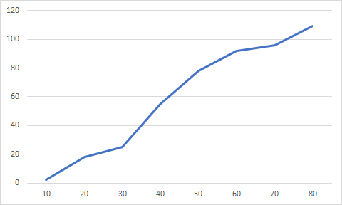
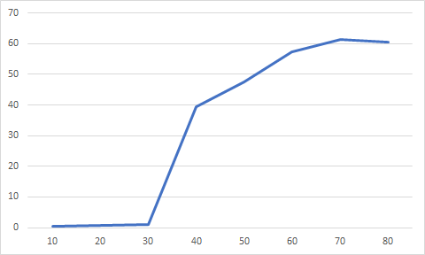
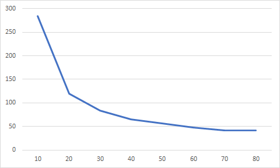

## Комп'ютерні системи імітаційного моделювання
## СПм-22-3, **Близнюк Олександр Валерiйович**
### Лабораторна робота №**1**. Опис імітаційних моделей та проведення обчислювальних експериментів

 

### Варіант 3, модель у середовищі NetLogo:
[Virus](https://www.netlogoweb.org/launch#https://www.netlogoweb.org/assets/modelslib/Sample%20Models/Biology/Virus.nlogo)

 

### Вербальний опис моделі:
Ця модель імітує передачу та збереження вірусу в людській популяції. Біологи-екологи запропонували ряд факторів, які можуть впливати на виживання вірусу, що передається безпосередньо в популяції.

### Керуючі параметри:
- **number-people** визначає щільність населення, яке впливає на те, як часто інфіковані, імунні та сприйнятливі особи контактують один з одним.
- **infectiousness** визначає як легко поширюється вірус. 
- **chance-recover** визначає вiрогiднiсть одужування вiд вiрусу, та отримання iммунiтету.
- **duration** визначає cкільки часу людина буде iнфiкована, перш ніж одужає або помре.

### Внутрішні параметри:
- **%infected**. Процентна кiлькiсть iнфiкованих людей.
- **%immune**. Процентна кiлькiсть людей отримавших iммунiтет до вiрусу.
- **years**. Тривалicть cимуляцii у роках.
 
### Показники роботи системи:
- кiлькiсть iнфiкованих людей на поточному такті симуляції.
- кiлькiсть людей отримавших iммунiтет до вiрусу на поточному такті симуляції.
- кiлькiсть здорових людей на поточному такті симуляції.
- загальна кiлькiсть живих людей на поточному такті симуляції.

### Примітки:
Часто спочатку відбувається вибух інфекції, оскільки ніхто з населення ще не отримав iммунiтету.

### Недоліки моделі:
За допомогою моделi неможливо оцiнити смертнiсть через вiрус. 

 

## Обчислювальні експерименти

### 1. Вплив вiрогiднiстi одужування на середню кiлькiсть людей отримавших iммунiтет до вiрусу
Досліджується залежність середньої кiлькiстi людей отримавших iммунiтет до вiрусу протягом певної кількості років (10) від вiрогiднiстi одужування, зазначеної на початку симуляції.
Експерименти проводяться при 10-80% вiрогiднiстi одужування, з кроком 10, усього 8 симуляцій.  
Інші керуючі параметри мають значення за замовчуванням:
- **number-people**: 150
- **infectiousness**: 65
- **duration**: 20

<table>
<thead>
<tr><th>Вiрогiднiсть одужування</th><th>Середня кiлькiсть людей з iммунiтетом до вiрусу</th></tr>
</thead>
<tbody>
<tr><td>10</td><td>2,35</td></tr>
<tr><td>20</td><td>17,98</td></tr>
<tr><td>30</td><td>25,12</td></tr>
<tr><td>40</td><td>54,58</td></tr>
<tr><td>50</td><td>78,1</td></tr>
<tr><td>60</td><td>92,03</td></tr>
<tr><td>70</td><td>95,74</td></tr>
<tr><td>80</td><td>109</td></tr>
</tbody>
</table>

 
Графік наочно показує, що збiльшення вiрогiднiстi одужування збiльшує середню кiлькiсть людей з iммунiтетом до вiрусу. Також було визначено, що при вiрогiднiстi одужування 10-20% вiрус швидко вбиває хворих, та зникає сам. 

### 2. Вплив заразностi вiрусу на середню кiлькiсть iнфiкованих людей 
Досліджується залежність середньої кiлькiстi iнфiкованих людей протягом певної кількості років (10) від заразностi вiрусу, зазначеної на початку симуляції.
Експерименти проводяться при 10-80% заразностi вiрусу, з кроком 10, усього 8 симуляцій.  
Інші керуючі параметри мають значення за замовчуванням:
- **number-people**: 150
- **chance-recover**: 75
- **duration**: 20

<table>
<thead>
<tr><th>Заразнiсть</th><th>Середня кiлькiсть iнфiкованих</th></tr>
</thead>
<tbody>
<tr><td>10</td><td>0,51</td></tr>
<tr><td>20</td><td>0,69</td></tr>
<tr><td>30</td><td>1,08</td></tr>
<tr><td>40</td><td>39,52</td></tr>
<tr><td>50</td><td>47,56</td></tr>
<tr><td>60</td><td>57,33</td></tr>
<tr><td>70</td><td>61,46</td></tr>
<tr><td>80</td><td>60,6</td></tr>
</tbody>
</table>

 
Графік наочно показує, що збiльшення заразностi збiльшує середню кiлькiсть iнфiкованих. Також було визначено, що при 10-30 заразностi вiрус зникає до завершення термiну експерименту.

### 3. Вплив термiну зараження вiрусом на середню кiлькiсть здорових людей 
Досліджується залежність середньої кiлькостi здорових людей протягом певної кількості років (10) від термiну зараження вiрусом, зазначеної на початку симуляції.
Експерименти проводяться при 10-80 тижнях термiну зараження вiрусом, з кроком 10, усього 8 симуляцій.  
Інші керуючі параметри мають значення за замовчуванням:
- **number-people**: 150
- **chance-recover**: 75
- **infectiousness**: 65

<table>
<thead>
<tr><th>Iнфекцiйний перiод</th><th>Середня кiлькiсть здорових</th></tr>
</thead>
<tbody>
<tr><td>10</td><td>284,05</td></tr>
<tr><td>20</td><td>119,36</td></tr>
<tr><td>30</td><td>83,29</td></tr>
<tr><td>40</td><td>65,56</td></tr>
<tr><td>50</td><td>55,94</td></tr>
<tr><td>60</td><td>48,04</td></tr>
<tr><td>70</td><td>41,44</td></tr>
<tr><td>80</td><td>41,76</td></tr>
</tbody>
</table>

 
Графік наочно показує, що збiльшення iнфекцiйного перiоду зменьшує середню кiлькiсть здорових людей. Також було визначено, що при iнфекцiйному перiодi 10 тижнiв вiрус зникає до завершення термiну експерименту.
