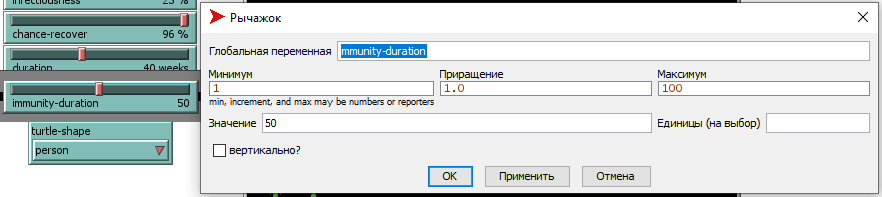
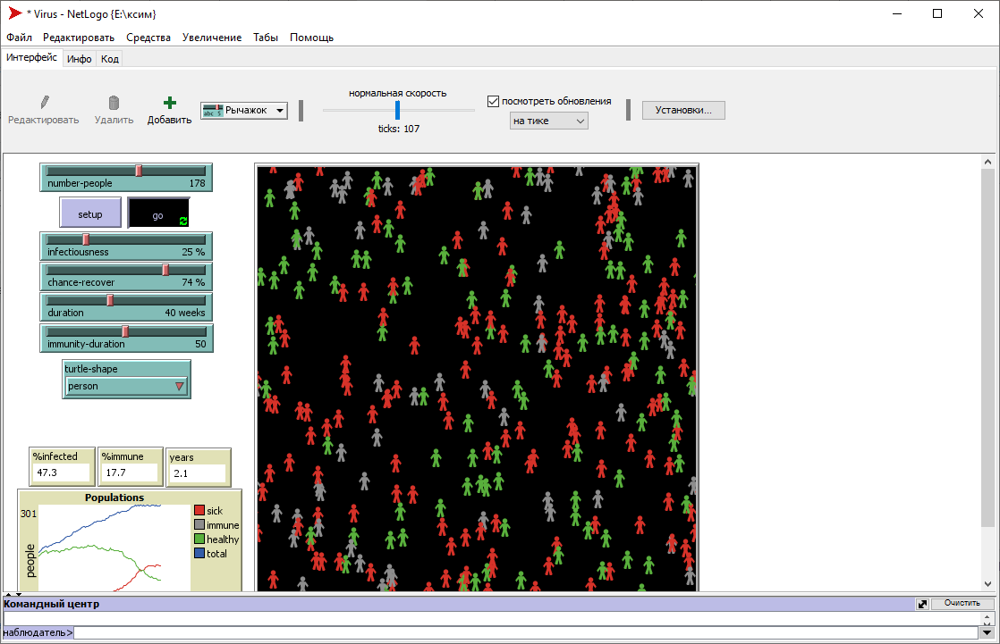
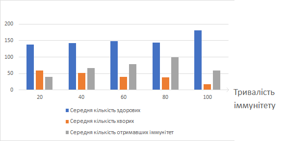

## Комп'ютерні системи імітаційного моделювання
## СПм-22-3, **Близнюк Олександр Валерiйович**
### Лабораторна робота №**2**. Редагування імітаційних моделей у середовищі NetLogo

 

### Варіант 3, модель у середовищі NetLogo:
[Virus]
(https://www.netlogoweb.org/launch#https://www.netlogoweb.org/assets/modelslib/Sample%20Models/Biology/Virus.nlogo)

 

### Внесені зміни у вихідну логіку моделі, за варіантом:

**Додавання впливу віку на інфікування та результат захворювання**   
Додано вплив вiку на iнфiкування:
<pre>
 if ((random-float 100) - (age / (52 * 10))) < infectiousness  
</pre>
Додано вплив вiку на результат захворювання:
<pre>
if age > (59 * 52) [die]
ifelse ((random-float 100) + (age / (52 * 10))) < chance-recover   
[ become-immune ]
[ die ]
</pre>

**Додавання впливу ступеня поширення захворювання (поточного відсотка інфікованих) на вірогідність появи нових агентів**
Додано вплив ступеня поширення захворювання (поточного відсотка інфікованих) на вірогідність появи нових агентів:
<pre>
if count turtles < carrying-capacity and ((random-float 100) - (%infected / 10)) < chance-reproduce
</pre>

**Додавання можливостi регулювання тривалості імунітету та вірогідності захворіти повторно** 
Додано можливiсть регулювання тривалостi iммунiтету:

Також було прибрано об'явлення в глобальних змiнних та встановлення значення за замовчуванням.

Додано параметр агента чи вже була людина iнфiкована:
<pre>
was-sick?
</pre>
Також додано значення за замовчуванням та при створеннi нового агенту параметру was-sick?:
<pre>
set was-sick? false
</pre>
Додано влив даного параметру на процедуру to infect:
<pre>
to infect 
  ask other turtles-here with [ not sick? and not immune? ]
    [ if was-sick? [ 
      if ((random-float 150) - (age / (52 * 10))) < infectiousness  
      [ get-sick ]
      stop
      ]
      if ((random-float 100) - (age / (52 * 10))) < infectiousness  
      [ get-sick ] ]
end
</pre>

### Внесені зміни у вихідну логіку моделі, на власний розсуд:

**Змiнено тривалiсть життя та вплив вiку на можливiсть розмноження**.
Тривалiсть життя змiнена з 50 до 70 рокiв:
<pre>
set lifespan 70 * 52
</pre>

Додано вплив вiку на вiрогiднiсть розмноження:
<pre>
if count turtles < carrying-capacity and ((random-float 100) - (%infected / 10)) < chance-reproduce and age > (52 * 17) and age < (52 * 50) 
</pre>

Фінальний код моделі та її інтерфейс доступні за [посиланням](example-model.nlogo).
 

## Обчислювальні експерименти

### 1. Вплив тривалостi iммунiтету на середню кiлькiсть здорових, хворих та отримавших iммунiтет людей 
Експеримент буде проходити протягом 10 рокiв. Тривалiсть iммунiтету буде змiнюватися вiд 20 до 100 тижнiв iз кроком 20, усього 5 експериментiв.
Iншi початковi значення залишуються за замовчуванням:
- **number-people**: 150
- **infectiousness**: 65
- **chance-recover**: 75
- **duration**: 20

<table>
<thead>
<tr><th>Тривалiсть iммунiтету</th><th>Середня кiлькiсть здорових</th><th>Середня кiлькiсть хворих</th><th>Середня кiлькiсть отримавших iммунiтет</th></th></tr>
</thead>
<tbody>
<tr><td>20</td><td>137,93</td><td>58,42</td><td>39,57</td></tr>
<tr><td>40</td><td>141,88</td><td>51,74</td><td>66,71</td></tr>
<tr><td>60</td><td>148,13</td><td>39,37</td><td>78,57</td></tr>
<tr><td>80</td><td>144,51</td><td>38</td><td>98,91</td></tr>
<tr><td>100</td><td>182,02</td><td>17,67</td><td>59,05</td></tr>
</tbody>
</table>

 
Графік наочно показує, що збiльшення тривалостi iммунiтету позитивно впливає на кiлькicть здорових людей, та зменшує кiлькiсть хворих. Також було визначено, що при 100 тижнях тривалостi iммунiтету вiрус зникає до завершення термiну експерименту.
