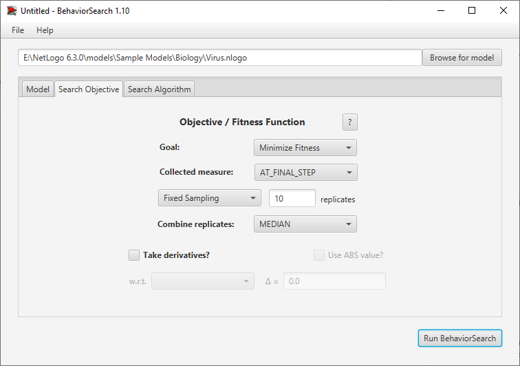

## Комп'ютерні системи імітаційного моделювання
## СПм-22-3, **Близнюк Олександр Валерiйович**
### Лабораторна робота №**3**. Використання засобів обчислювального интелекту для оптимізації імітаційних моделей

 

### Варіант 3, модель у середовищі NetLogo:
[Virus](https://www.netlogoweb.org/launch#https://www.netlogoweb.org/assets/modelslib/Sample%20Models/Biology/Virus.nlogo)

 

### Налаштування середовища BehaviorSearch:

**Обрана модель**:
<pre>
E:\NetLogo 6.3.0\models\Sample Models\Biology\Virus.nlogo
</pre>
**Параметри моделі** (вкладка Model):  
<pre>
["duration" [0 1 99]]
["chance-recover" [0 1 99]]
["infectiousness" [0 1 99]]
["number-people" 150]
["turtle-shape" "person" "circle"]
</pre>
 
Використовувана **міра**:  
Для фітнес-функції було обрано **значення проценту хворих людей**, вираз для її розрахунку взято з налаштувань графіка аналізованої імітаційної моделі в середовищі NetLogo  
  
та вказано у параметрі "**Measure**":
<pre>
%infected
</pre>
**Процент хворих людей** розраховується на кожному тактi симуляції тривалістю, *для приклада*, 500 тактів , починаючи з 0 такту симуляції.   
Параметр зупинки за умовою ("**Stop if**") використовувався коли кiлькiсть хворих нулюва:
<pre>
%infected = 0
</pre>
Загальний вигляд вкладки налаштувань параметрів моделі:  

**Налаштування цільової функції** (вкладка Search Objective):  
Метою підбору параметрів імітаційної моделі, що описує цикли захворювань та одужувань, є **мiнiмізація** значення кiлькостi хворих – це вказано через параметр "**Goal**" зі значенням **Minimize Fitness**. Тобто необхідно визначити такі параметри налаштувань моделі, у яких кiлькiсть хворих зводиться до найменших значень або взагалi буде нулювою. При цьому цікавить найменша кiлькiсть хворих у кiнцi суляції (тривалість якої (500 кроків) вказувалася на минулій вкладці). Для цього у параметрі "**Collected measure**", що визначає спосіб обліку значень обраного показника, вказано **AT_FINAL_STEP**.  
Щоб уникнути викривлення результатів через випадкові значення, що використовуються в логіці самої імітаційної моделі, **кожна симуляція повторюється по 10 разів**, результуюче значення розраховується як **серединне**.  
Загальний вигляд вкладки налаштувань цільової функції:  

**Налаштування алгоритму пошуку** (вкладка Search Algorithm):  
Загальний вид вкладки налаштувань алгоритму пошуку:  

 

### Результати використання BehaviorSearch:
Діалогове вікно запуску пошуку:  

 
Результат пошуку параметрів імітаційної моделі, використовуючи **генетичний алгоритм**:  

 
Результат пошуку параметрів імітаційної моделі, використовуючи **випадковий пошук**:  

